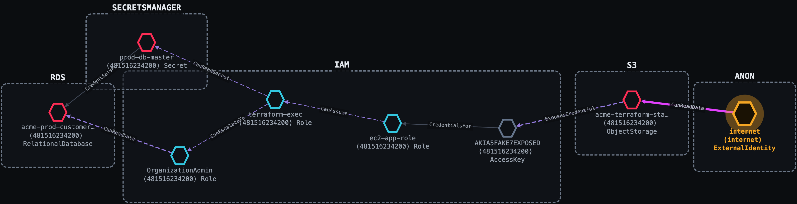
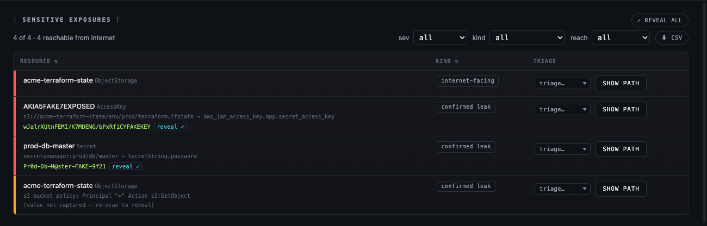
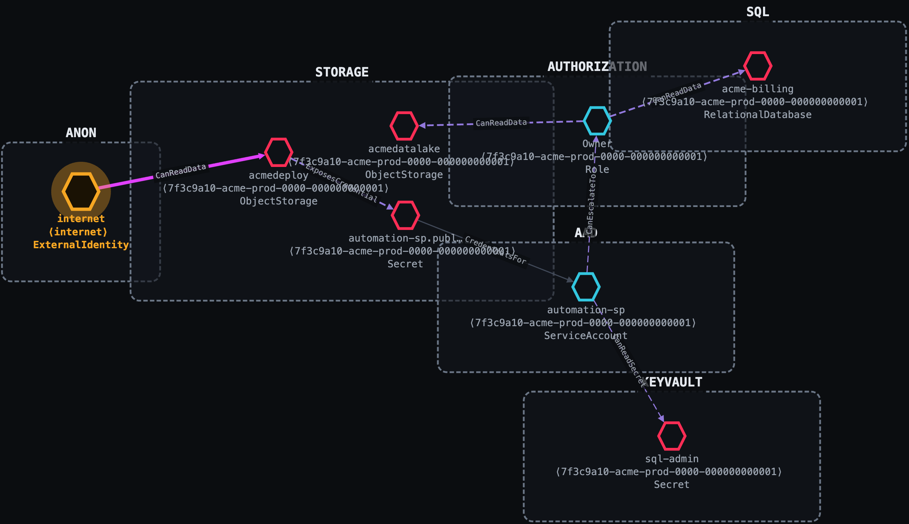
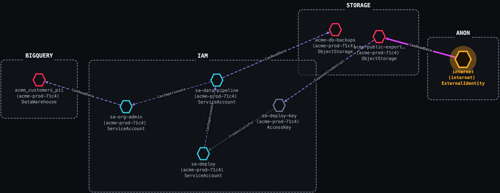

# Thunderstorm

**You don't have 4,000 findings. You have six paths to your crown jewels.**



A CSPM hands you a flat, deduplicated, severity-sorted list of misconfigurations and leaves
you to guess which ones matter. Thunderstorm reasons about **reachability**: it collects
your cloud read-only, models it as a graph of security capabilities, and tells you that a
GitHub Actions OIDC trust leads, in four hops, to your production data lake.

None of the hops above is a finding on its own. A public bucket, a key in a state file, an
assumable role, one over-broad IAM action. The **path** is the finding, and the path is
what almost nothing else computes.

**Deep on the platform you point it at.** Run it against an AWS account, an Azure
subscription, or a GCP project, and it maps that one environment in the provider's own
terms: STS assume-role and IAM privilege escalation in AWS, RBAC and managed-identity
chains in Azure, service-account impersonation in GCP. One environment, one graph, modeled
the way that cloud actually works.

Plenty of tools enumerate more. The claim here is that Thunderstorm **reasons over what it
enumerates** with real depth: 219 resource types, 80 edge types, 2,400+ derivation rules,
and 1,049 mapped credential-leak sites, all sourced from
[RAGE](https://github.com/trustedsec/rage).

**RAGE is the format, Thunderstorm produces it, Blaze explores it.**

---

## See it walk a real attack chain

They are what Thunderstorm produces from a single `scan`.

### AWS: a public Terraform state file to full account takeover

One misconfigured S3 bucket. Thunderstorm traces it six hops to the production customer
database, and a second route straight to the database master secret.

```
Internet ──public s3:GetObject──▶ acme-terraform-state (public bucket)
         ──ExposesCredential────▶ AKIA…            (access key leaked in tfstate)
         ──CredentialsFor───────▶ ec2-app-role
         ──CanAssume────────────▶ terraform-exec    (sts:AssumeRole)
         ──CanEscalateTo────────▶ OrganizationAdmin (iam:AttachRolePolicy)
         ──CanReadData──────────▶ acme-prod-customers (PII)
```

Every hop carries the permission that grants it, the evidence that proves it, and a
plain-English narrative. The leaked values come out with it:



### Azure: a public storage container to subscription Owner

A publicly readable blob leaks a service-principal secret. A Contributor with one extra
permission promotes itself to **subscription Owner**. No app exploit; just cloud
misconfiguration and IAM.



```
Internet ──anonymous blob read──▶ acmedeploy (public Storage account)
         ──ExposesCredential────▶ automation-sp secret (in a deploy config blob)
         ──CredentialsFor───────▶ automation-sp (Contributor)
         ──CanEscalateTo────────▶ Owner  (Microsoft.Authorization/roleAssignments/write)
         ──CanReadData──────────▶ acmedatalake
```

### GCP: a committed key to a two-hop impersonation chain

Service-account impersonation is invisible to most tooling. Thunderstorm treats
`iam.serviceAccounts.getAccessToken` as the lateral-movement edge it is.



```
Internet ──public allUsers───▶ acme-public-exports (GCS)
         ──ExposesCredential─▶ sa-deploy-key
         ──CredentialsFor────▶ sa-deploy
         ──CanImpersonate────▶ sa-data-pipeline
         ──CanImpersonate────▶ sa-org-admin
         ──CanReadData───────▶ acme_customers_pii (BigQuery)
```

## What you get

- **Attack-path graphs, interactive and offline.** Pick any foothold, filter by reachable / crown-jewels / everything, and find the shortest path to any target.
- **Sensitive exposures.** Public resources, plus credentials and secrets Thunderstorm actually read from where they leak, with the captured value and its exact location.
- **Privilege escalation and lateral movement.** Assume-role, impersonation, managed identity, self-grant, and cross-account/tenant edges, each tied to the permission that enables it.
- **Explainable by design.** Every edge carries evidence, permissions, conditions, confidence, and a narrative.
- **A print-ready report.** Chain of custody, blast radius, annotated paths, confirmed leaks.
- **Blaze Lite.** A single, offline HTML viewer embedded in the binary. `view` opens it in your browser; nothing is uploaded.

---

## Requirements

- **Go 1.26+** (two modules: `collectors/`, `engine/`).
- **Read-only credentials** for the target you scan (e.g. an AWS profile, GCP ADC, or Azure login).
- **RAGE**: the catalog Thunderstorm consumes. A vendored snapshot is embedded in the binary, so no separate download is required to build or run (see below).

## RAGE is the source of truth

Thunderstorm carries **no** taxonomy, mappings, or rules of its own. It consumes the RAGE
standard end-to-end:

| Concern | Lives in RAGE |
|---------|---------------|
| Node / edge taxonomy, conditions | `vocab/{node-types,edge-types,conditions}.json` |
| Native→generic mappings + collection recipes | `providers/{aws,gcp,azure}.json` |
| Derivation rule corpus | `rules/` |
| Credential-exposure catalog | `exposure-db/{aws,gcp,azure}.json` + `vocabulary.json` |

**Version tie:** RAGE's `spec_version` is the single number that pins Thunderstorm to a
RAGE release. The collector reads it live from the RAGE it was built against
(`thunderstorm version` prints `RAGE <v>`) and stamps it into every graph it emits; Blaze
Lite reads that stamp and warns when a graph was built against a version it doesn't support.

**How RAGE is resolved** (first match wins):
1. `$RAGE_ROOT`: a live RAGE checkout, if you set it (dev override; edits apply without rebuild).
2. **Default:** the vendored snapshot at `collectors/rage/`, embedded in the binary.

Refresh the snapshot with `make RAGE_ROOT=/path/to/rage` (or `go generate ./...` in
`collectors/`). RAGE lives at [github.com/trustedsec/rage](https://github.com/trustedsec/rage).

## Authentication

Thunderstorm scans **read-only** using your existing cloud credentials; it never manages
secrets and never writes to the target. Log in with the provider's normal tooling, then
point `scan` at the account / project / subscription.

**AWS** uses the standard AWS SDK credential chain (a named profile, env vars, SSO, or an instance role):
```bash
aws configure --profile myprofile        # or: aws sso login --profile myprofile
./bin/thunderstorm scan --profile myprofile [--region us-east-1]
```

**GCP** uses Application Default Credentials (ADC). Log in, then pass the project:
```bash
gcloud auth application-default login
./bin/thunderstorm scan --provider gcp --project my-project-id
```
A service-account key also works via `GOOGLE_APPLICATION_CREDENTIALS=/path/key.json`.

**Azure** uses the Azure CLI / DefaultAzureCredential chain. Log in, then optionally scope to one subscription:
```bash
az login
./bin/thunderstorm scan --provider azure [--subscription <sub-id>]
```
A service principal also works via `AZURE_CLIENT_ID` / `AZURE_CLIENT_SECRET` / `AZURE_TENANT_ID`.

Scanning many accounts at once uses `--aws-profiles`, `--gcp-projects`,
`--azure-subscriptions`, or a `--scopes` file (`provider:scope` per line).

## Usage

Build (produces `./bin/thunderstorm`):
```bash
make                              # build with the embedded RAGE snapshot
make RAGE_ROOT=/path/to/RAGE      # re-vendor from a live RAGE checkout, then build
```

Scan, then explore:
```bash
./bin/thunderstorm scan --profile <aws-profile>   # → a single .rage.ndjson attack graph
./bin/thunderstorm view --in engagement.zip       # open it offline in Blaze Lite
./bin/thunderstorm redact --in engagement.zip --out redacted.zip   # de-identify for sharing
```
Without `--out`, engagements land in `./output/` (git-ignored). That's the whole tool:
`scan`, `redact`, `view`, `version`.

## Design invariants

- **Ontology is owned by RAGE.** Adding a provider/service means editing RAGE, never a Thunderstorm-local schema.
- **Capabilities, not inventory.** Every walkable edge is a security capability; inventory is `STRUCTURAL` and excluded from paths.
- **Explainable.** Every edge carries evidence, permissions, conditions, confidence, and a human narrative.
- **Conditions are first-class.** Edge state = ACTIVE / CONDITIONAL / POTENTIAL / BLOCKED / UNKNOWN; BLOCKED edges are kept to explain why a path fails.

## License

Thunderstorm is licensed under the **GNU General Public License v3** (see [`LICENSE`](LICENSE)).
It is an offensive security tool provided for **authorized** security testing, education,
and research only; obtain explicit authorization before running it against any environment
you do not own. See the Authorized-Use notice at the top of `LICENSE`.
